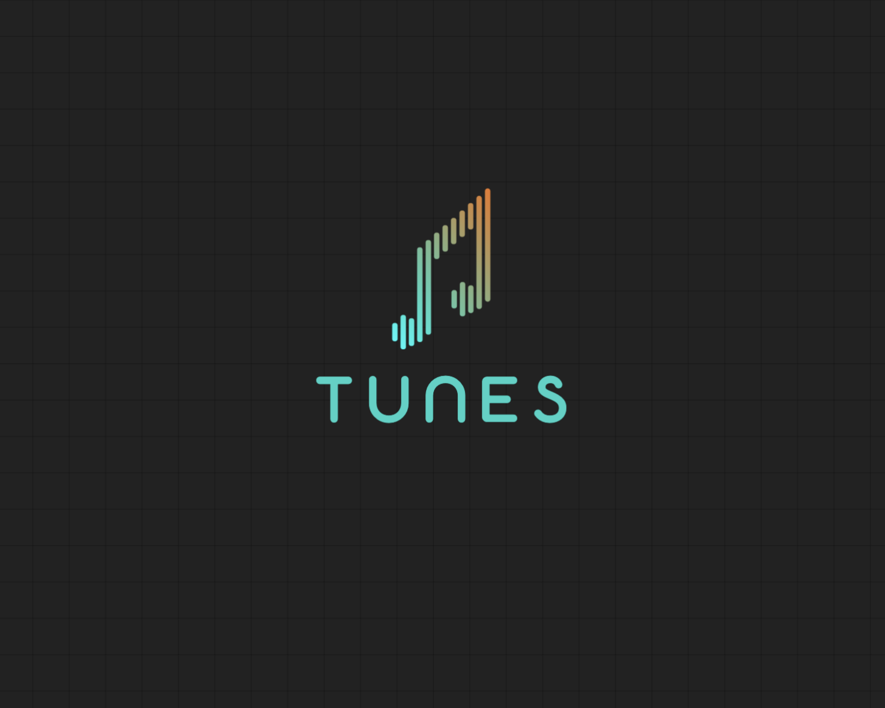

# TUNES 
**A simple flask application to take care of your music collection**.




## PACKAGES FOR THE PROJECT

```bash
  pip install flask
```
**Flask**  is a lightweight, micro web framework for Python, designed for simplicity and flexibility. It allows developers to build web applications quickly with minimal boilerplate code. Flask supports extensions for adding features like database integration, form handling, and authentication, making it versatile for both small projects and scalable applications..


## RUNNING THE PROJECT LOCALLY 
Git clone the project using the project HTTP / SSH link.

```bash
  git clone <link>
```
Use the 'll' or 'ls-al' terminal command to list the directories and directory structure.
```bash
  ll
  ls -al
```
```bash
  cd TUNES/
```
Installing the dependency packages for the project.
```bash
  pip install -r requirements.txt
```


## API ROUTE

```http
    http://127.0.0.1:5000 
```

## API ENDPOINTS
The home page of the application
```bash
    http://127.0.0.1:5000/
    http://127.0.0.1:5000/home
```
The registration page
```bash
    http://127.0.0.1:5000/registration
```
The user / customer login page
```bash
    http://127.0.0.1:5000/login
```
The admin inventory page
```bash
    http://127.0.0.1:5000/admin
```
The all explore page
```bash
    http://127.0.0.1:5000/explore
```


